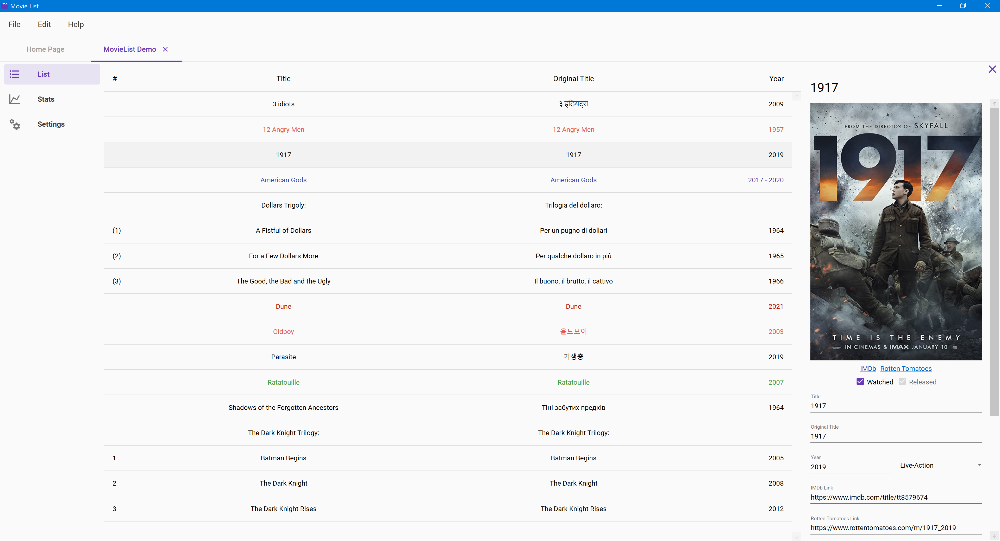
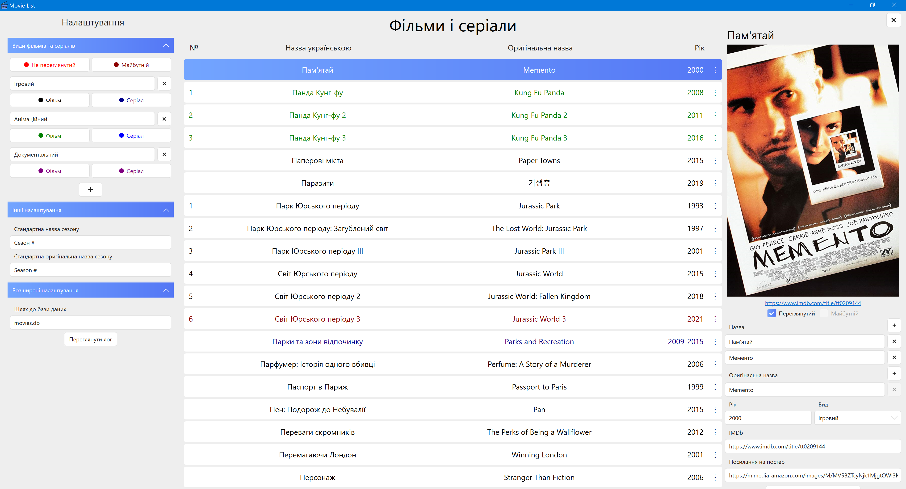
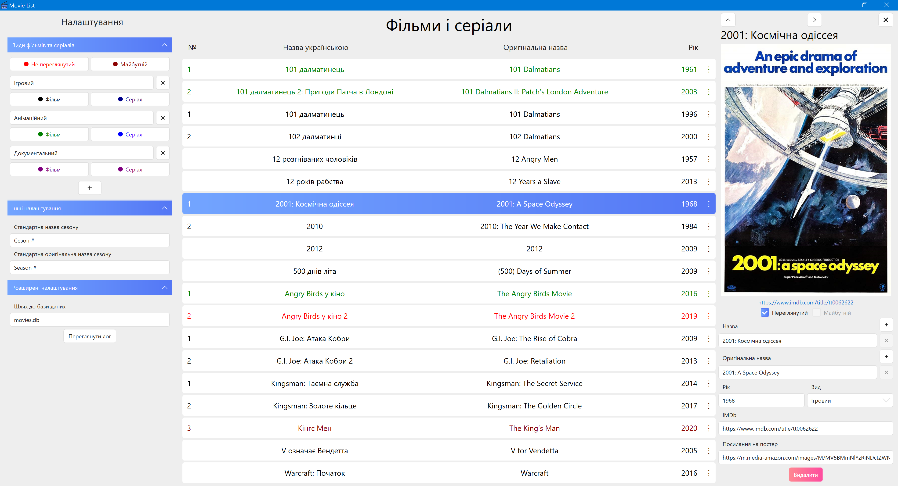

# Version History

This article provides info on what's new in every version of the Movie List app.

## Version 0.2

This version adds searching, filtering, and sorting capabilities to the app. Also, tags can now be added to movies and series to make searching/filtering easier. This release is still very incomplete and far from being stable.

The following breaking changes were added to the list files:

* The `Tags`, `MovieTags`, and `SeriesTags` tables were added.
* The `IsAnthology` column was removed from series - if you want this info, implement it yourself through tags.
* The following keys were added to the `Settings` table: `list.sort.order.1`, `list.sort.order.2`, `list.sort.direction.1`, and `list.sort.direction.2`.
* The following keys were changed in the `Settings` table: `season.title.default` -&gt; `list.season.title.default`, `season.title.default-original` -&gt; `list.season.title.default-original`.

## Version 0.1

This is the first usable version of the app, albeit very incomplete. It provides the most basic functionality:

* Creating/opening list files
* Adding/editing/removing movies, series, and franchises
* Editing file settings, including kinds
* Editing app preferences

## Ancient History

In the beginning, the app looked and felt very differently. There could be only a sinlge list file, and the path to it was specified in the preferences. There were no tabs. And the UI was in Ukrainian, instead of English.

Afterwards the app was completely rewritten, but this version can be found under the `old` tag on GitHub.

