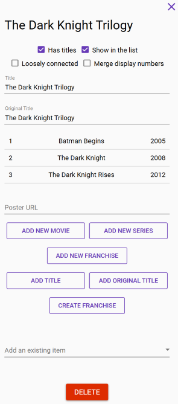

# The Franchise Form

Lots of movies and series have multiple parts, so it's logical to have these movies/series be grouped together in the list. This is just what franchises are for: grouping related movies, series or even other franchises.

Franchises can be created and edited via the franchise forms, but those can't be created directly. Rather, you first create a movie or a series, and after saving it, you can create a franchise where this movie/series is the first part, using the _Create franchise_ button at the bottom of the form. Here's how a franchise form looks:

The franchise form is a little different from other forms in that it's focus is on actions rather than fields and data. It consists of the following parts:

* Header which contains the first title, the _close_ button, and a few other buttons if the franchise is a part of another franchise
* Poster \(or logo\), if present
* Form fields
* The franchise entry list
* Buttons for various actions

## Form Fields

The franchise form contains the following main fields:

* Check-box which indicates whether the franchise has its own titles
* Check-box which indicates whether the franchise should be shown as an item in the list
* Check-box which indicates whether the franchise entries are loosely connected
* Check-box which indicates whether the display numbers should be merged with those of the previous franchise
* Titles \(if the franchise has titles\)
* Original titles \(if the franchise has titles\)
* Poster URL

The franchise form is the only form where titles are not required. If the franchise doesn't have its own titles, then the titles of its first entry are considered as the titles of the franchise. If the franchise has its own titles, you can specify whether to show it as an item in the list. This is not always necessary since the franchise can have a title which is very similar to the first entry's title.

The entries of the franchise can be loosely connected. This has purely demostrational value - the entry numbers will be shown in parentheses. For example, the Dollars Trilogy can be considered to be loosely connected, because its movies can be thought of as independent.

Franchises rarely have their own posters, but may have separate logos, and so the franchise form includes the poster URL as well.

## Franchise Entries

When you create a new franchise through a movie of series, it already contains one entry. You can add other entries using one of the three _add_ buttons - _Add movie_, _Add series_ or _Add franchise_.

When you add a new entry, its respective form is opened. There's nothing different about creating a new franchise entry from creating a standalone item. When you save it, it is added to the franchise entry list. If you cancel, you are taken back to the franchise form.

If you right-click on a franchise entry, a context menu will apper which has the following actions:

* Move up \(if the entry is not the first one\)
* Move down \(if the entry is not the last one\)
* Hide/show display number
* Detach

You can move the entries around, and they don't have to be in chronological order \(although it's usually logical that they be in chronological order\).

You can hide the display numbers of individual entries if they are considered 'unofficial'. For example, the 1969 Casino Royale movie is an unofficial James Bond movie, but you can add it to the James Bond franchise and hide its display number so it doesn't offset the display numbers of the following movies.

You can also detach franchise entries so that they become standalone items.

In addition, you can add an existing item using the drop-down at the bottom of the form. Select an item and it will be added as the last entry of the franchise. You can only add standalone items. If you want to add an item which belongs to a different franchise, you have to detach it first.

## Franchise Hierarchies

In addition to movies and series, a franchise can also contain other franchises. This is never necessary though. You can always group movies and series properly with only one level of franchises. But if you want to represent the data in your list in a more structured manner, you can introduce multiple levels of franchises. For example, both Harry Potter and Fantastic Beasts belong to a franchise called Wizarding World.

If you have multiple levels of franchises, you can choose to merge their entries' display numbers. This functionality is limited to two levels only though.

Merging display numbers can be better explained with an example. Suppose you created a franchise called Star Wars which contains three other franchises: The Original Trilogy, The Prequel Trilogy and The Sequel Trilogy, each of which contains three movies, for a total of nine movies \(anthology films and series notwithstanding\). If you open any of the child franchises, you'll see that every movie is numbered 1, 2, and 3. This may not be desirable, because all of these movies are part of one big Star Wars franchise, and so it would be better to say that e.g. The Revenge of the Sith is the sixth movie overall, and not just the third movie of the Prequel Trilogy. You can do that by merging the display numbers. If you check the _merge display numbers_ check-box in the child franchises \(the trilogies\), then the Prequel Trilogy will continue numbering its movies after the Original Trilogy \(so, 4, 5, and 6\) and the Sequel Trilogy will continue numbering its movies after the Prequel Trilogy \(so, 7, 8, and 9\).

## Franchise Navigation Actions

If a movie, series, or a franchise are parts of a franchise, their forms will contain additional actions, most of which are located in the form header.

Firstly, you can go to the franchise, using the _up arrow_ button in the form's header, or using the _Go to franchise_ button at the bottom of the form which substitues the _Create franchise_ button since the latter is not needed anymore.

Secondly, you can move to the next or previous franchise entry using the arrow buttons in the form's header, just like you can move between the series componentes if you open one of those forms.

These actions are available only when the form doesn't contain changes.

## Other Actions

The franchise form has a couple other action buttons:

* Delete the franchise
* Create a franchise

You can delete the franchise only when the form doesn't contain changes. When you delete the franchise, none of its entries are deleted. Instead, they are all detached. You have to delete all entries manually.

Mind that the _Add franchise_ and _Create franchise_ buttons have similar names, but very different functionality. _Add franchise_ adds a new entry to the current franchise. _Create franchise_ is the same as in other forms - it creates a new franchise which has the current franchise as its first entry.

