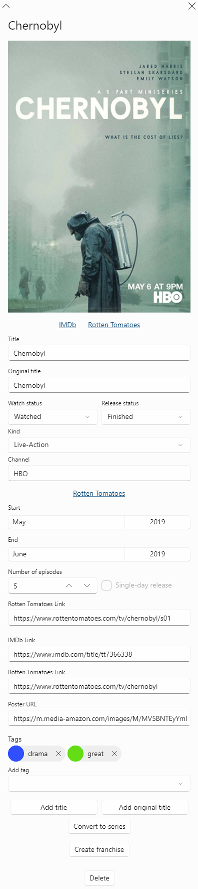

# The Miniseries Form

The miniseries form describes series which are limited in nature. In the context of this app, a miniseries has only one season, which in turn has only one release period, and no special episodes. Here's how a miniseries form looks:

As you can see, the miniseries forms are much simpler than the full series forms as they don't contain other separate forms. You can't create a miniseries form directly - you create it by creating a full series form and converting it to miniseries.

The miniseries form consists of the following parts:

* Header which contains the first title, the _close_ button, and a few other buttons if the miniseries is a part of a franchise \(which are discussed in the article on franchises\);
* Poster and links, if present;
* Main form fields;
* The period subform;
* Additional fields;
* Buttons for various actions.

## Main Form Fields

The miniseries form contains the following main fields:

* Titles \(at least one required\);
* Original titles \(at least one required\);
* Watch status \(required\);
* Release status \(required\);
* Kind \(required\).

These fields are basically the same as in the full series form.

## The Period Subform

The miniseries form contains a single period subform which looks and behaves exactly like period subforms in season forms. Look at the series form article to learn more about period subforms.

## Additional Form Fields

The miniseries form contains the following additional fields below the period subform:

* IMDb link;
* Rotten Tomatoes link;
* Poster URL;
* Tags.

It may be a little confusing to see that the RT link field for the miniseries is lower than the RT link field for its single season \(RT has a separate page for miniseries' seasons\). This is because the season RT link is contained in the period subform and it comes before the RT link of the miniseries. The RT link for the miniseries is located directly below the poster, and the RT link for the season is contained at the top of the period subform.

The rules for tags are the same as in the full series form.

## Other Actions

The miniseries form has several other action buttons:

* Delete the miniseries;
* Convert to full series;
* Create a franchise;
* Other franchise actions which are discussed in the article on franchises.

You can convert a miniseries back to full series any time you like. The resulting form will contain a separate form for the series' sole season.

You can execute these actions only when the form doesn't contain changes.

