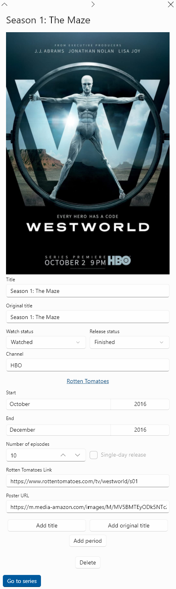
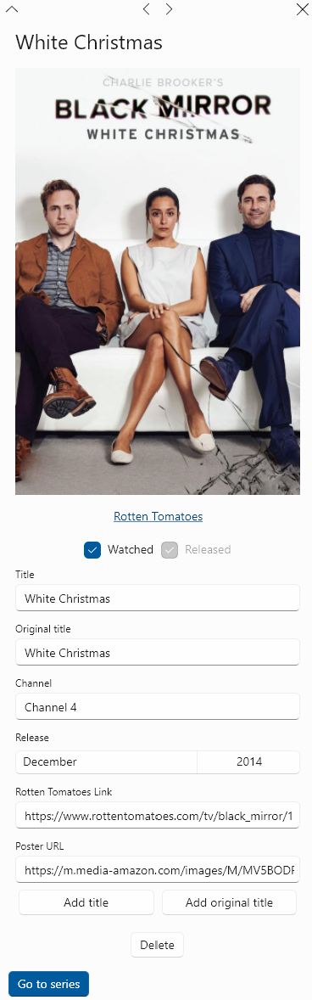

# The Series Form

This is a big one. It takes much more effort to add a series than it is to add a movie. Here's how a series form looks:

The series form consists of the following parts:

* Header which contains the first title, the _close_ button, and a few other buttons if the series is a part of a franchise \(which are discussed in the article on franchises\)
* Poster \(or logo\) and links, if present
* Main form fields
* The list of components: seasons and special episodes
* Additional fields
* Buttons for various actions

## Form Fields

The series form contains the following fields:

* Titles \(at least one required\)
* Original titles \(at least one required\)
* Watch status \(required\)
* Release status \(required\)
* Kind \(required\)
* IMDb link
* Rotten Tomatoes link
* Poster URL
* Tags

All the same rules apply to titles as with the movie form.

Since watching the series is more of a continuous process \(unless you binge it\), its watch status is more than just _watched_ or _not watched_. Here are the possible watch statuses:

* Not watched, if you haven't started watching the series yet;
* Watching, if you are currenly watching the series or waiting for new episodes;
* Watched, if you have watched the series in its entirety;
* Stopped watching, if you decided that the series is not worth your time anymore.

Like watch status, there's more to the release status than simply 'released' or 'not released'. Here are the possible release statuses:

* Not started;
* Running;
* Finished, if the series finished naturally;
* Cancelled, if the series was axed by the studio;
* Don't know/don't care, if you stopped watching the series and you don't want to track it in the app anymore.

You can select any kind from the list of kinds which you specify in the file's settings.

Links and the poster URL are not required, and indeed not every series is guaranteed to have an entry in IMDb or RT \(although, like with movies, I have yet to find a series which doesn't have an entry in IMDb\). Instead of a poster, you can put a URL of a series' logo, which I do for most series.

You can add any tag from the list of tags which you specify in the file's settings. Once added, you can remove any tag by clicking its _delete_ button. Only those tags that are applicable to series can be added.

## Series Components

Series must contain one or more components. A series component is either a season or a special episode which in the context of this app means an episode which was aired or released separately from others, even if the studio doesn't designate it as 'special' \(e.g. White Christmas is a standalone episode of Black Mirror\). You can add componentes through the _Add season_ or _Add special episode_ buttons. When you press one of them, a respective form is opened. You can't save a series unless it contains at least one component.

You can move series components up and down by right-clicking on a component and selecting the _Move up_ or _Move down_ context actions.

## Other Actions

The series form has several other action buttons:

* Delete the series;
* Convert to miniseries;
* Create a franchise;
* Other franchise actions which are discussed in the article on franchises.

You can convert a series to a miniseries. A miniseries is a one-season series without special episodes which is designed to be limited in nature. Miniseries have separate, simplified forms. You can convert a series to a miniseries only if it contains one season or none at all, and no special episodes.

You can execute these actions only when the form doesn't contain changes.

## The Season Form

When you add a new season or click on an existing one in the series form, a season form is opened. Here's how it looks:

Unlike the movie and series forms, the season form is not independent - it's considered to be part of the series form. You can't save a season directly; to save a season, go back to the series form and save the whole series. You can cancel any changes in the season form directly. If you cancel changes in the series form, all changes in all seasons will be cancelled as well \(new seasons will be removed, and deleted seasons will be returned\).

The season form consists of the following parts:

* Header which contains the first title, the _close_ button, and navigation buttons;
* Poster, if present;
* Main form fields;
* The list of release periods;
* Buttons for various actions.

### Season Form Fields

The season form contains the following fields \(all fields are required\):

* Titles;
* Original titles;
* Watch status;
* Release status;
* Original channel.

When you create a new season, its titles are generated using the default season titles from the file's settings.

As with series, there are several watch statuses:

* Not watched, if you haven't started watching the season;
* Watching, if you are currently watching it, or waiting for new episodes;
* Watched, if you have finished watching the full season;
* Hiatus, if the season is on a hiatus, or you decided to take a break from watching it;
* Stopped watching, if you haven't finished the season, and don't plan to finish it.

Likewise, there are several release statuses:

* Not started, if the season hasn't started airing or hasn't been released yet;
* Running, if new episodes are currently airing or are being released;
* Finished, if all episodes of the season have been released;
* Hiatus, if the season is on a hiatus and new episodes won't come for some time.
* Don't know/don't care, if you stopped watching the series and you don't want to track it in the app anymore.

The original channel is just for descriptive purposes. When you create a new season, by default it has the same channel as the previous series component. There may be situations when a series has multiple original channels \(e.g. Killing Eve is a co-production between BBC America and AMC\). If that's the case, choose one of those. The form is complicated as-is, and adding the possibility of multiple channels will only make it more complicated.

Seasons don't have separate IMDb pages.

### Season Release Periods

Unlike movies, where releases are tracked up to a year, series components are tracked up to a month. Seasons could have a start and end date directly, but it's not that simple. A single season may be released in parts during different periods \(like the last season of Breaking Bad or the last season of The Sopranos\). It wouldn't really represent the truth if you said that those seasons lasted for a year - they didn't. They lasted for a few weeks, had a hiatus and then for a few weeks next year. That's why seasons may contain multiple release periods. Every period has its own set of fields inside the season form. Obviously, every season requires at least one period, and there is no upper bound for the number of periods.

The period subform consists of the following fields \(all fields except links are required\):

* Period start;
* Period end;
* Number of episodes;
* Check-box which indicates whether it was a single-day release \(like for Netflix series\);
* Rotten Tomatoes link;
* Poster URL.

The year of the release can be between 1950 and 2100. The periods must be valid - the end date cannot be before the start date and periods cannot be interleaved.

The number of episodes for a single period can be between 1 and 50.

If it's a single-day release, you don't select the end month/year, becuase they are obviously equal to the start month/year.

Rotten Tomatoes tracks scores for individual seasons, but it may have multiple pages per season \(the only series I've seen have multiple pages per season is The Sopranos\). Thus the main part of the season form doesn't contain the RT link. Instead, the period subform has it, and that's why the link to RT is at the top of the period subform, and not directly below the poster, like in other forms.

If a season is released over multiple periods, it may be marketed differently during those periods and hence have different posters for different parts. If the season has multiple posters, you can switch between them with the little arrow buttons below the poster.

You can add a period by clicking the _Add period_ button at the bottom of the season form. If you want to remove a period, click the _delete_ button in the lower right corner of the period subform. You can't delete a period if there's only one present.

### Other Season Actions

The season form has a couple other action buttons at the bottom of the form:

* Delete the season;
* Go to series.

It also has action buttons in the form header:

* Go to series;
* Go to the next series component \(if the season is not the last component\);
* Go to the previous series component \(if the season is not the first component\).

You can delete the season only when the form doesn't contain changes and go to series only when it's valid.

## The Special Episode Form

When you add a new special episode or click on an existing one in the series form, a special episode form is opened. Here's how it looks:

This form is similar to the movie form and is much simpler than the season form. Like the season form, the special episode form is not independent - it's considered to be part fo the series form. You can't save an episode directly; to save an episode, go back to the series form and save the whole series. You can cancel any changes in the episode form directly. If you cancel changes in the series form, all changes in all episodes will be cancelled as well \(new episodes will be removed, and deleted episodes will be returned\).

The special episode form consists of the following parts:

* Header which contains the first title, the _close_ button, and navigation buttons;
* Poster and RT link, if present;
* Form fields;
* Buttons for various actions.

### Special Episode Form Fields

The special episode form contains the following fields:

* Check-box which indicates whether you watched the episode;
* Check-box which indicates whether the episode is released;
* Titles \(at least one required\);
* Original titles \(at least one required\);
* Release month and year \(required\);
* Rotten Tomatoes link;
* Poster URL.

As with movies, watch and release statuses are simple check-boxes. The _released_ check-box is enabled only if the release month/year is the same as the current month/year, because otherwise the release status is obvious. If you check the _watched_ check-box, the _released_ check-box becomes checked as well. If you uncheck the _released_ check-box, the _watched_ check-box becomes unchecked as well.

As with seasons, the year of the episode's release can be between 1950 and 2100.

### Special Episode Actions

The actions are the same as seasons' actions described in the _Other Season Actions_ section.

