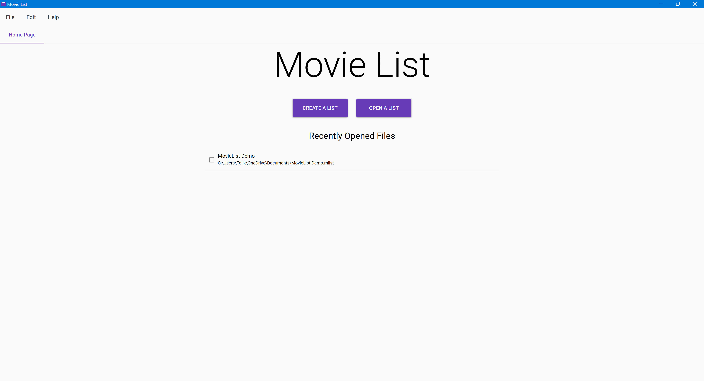

# Getting Started

## How to Get the App

The Movie List app works only on Windows \(and only tested on Windows 10\). Currently the only way to get this app is to download it from the 'releases' section on GitHub and extract it manually. The latest version is 0.2.

## Files and Tabs

The app works with files of the _.mlist_ extension. An _.mlist_ file represents a list of movies, series, and franchises, and some auxiliary settings. If you want Windows to bind the file extension to this app, you'll have to do it manually for now. All files are opened in separate tabs.

This is a single-instance app. You can't open multiple windows in this app. If you open it when it's already opened, it will simply show you the existing window. If you open a file when the app is already running, it will open the file in a new tab.

## The Home Page

The app's home page contains several features for working with files.

Firstly, you can create a list file. When you click on the _Create a list_ button, a _Save file_ dialog is opened. Enter the file name and select the location, click save, and an empty list file will be created and opened in a new tab. This is also available through the _File &gt; New_ menu item, or by pressing `Ctrl+N`.

Secondly, you can open an existing list file. There are several ways to do that. You can click the _Open a list_ button and select the file in the _Open file_ dialog. Or you can use the _File &gt; Open_ menu item, or press `Ctrl+O`. Also, you can drop a file into any area inside the app window to open a new file. Lastly, you can open the file through the File Explorer if you had Windows bind the file extension to this app.

Thirdly, you can view and open any files that you've recently opened. Simply double-click on any _Recently opened files_ entry to open it. You can also go to the _File &gt; Open Recent... &gt; {file name}_ menu item to open a recent file. To remove a file from the recently opened files list, click on the check-box on the left side of the entry, and click the _Remove from list_ button.

## Other Menu Items

You can learn about feature-specific menu items in the following articles.

The following menu items don't belong to specific features:

* _File &gt; Exit_ \(or press `Alt+F4`\) to exit the app \(obviously\)
* _Help &gt; About_ \(or press `F1`\) to view some basic info about the app

