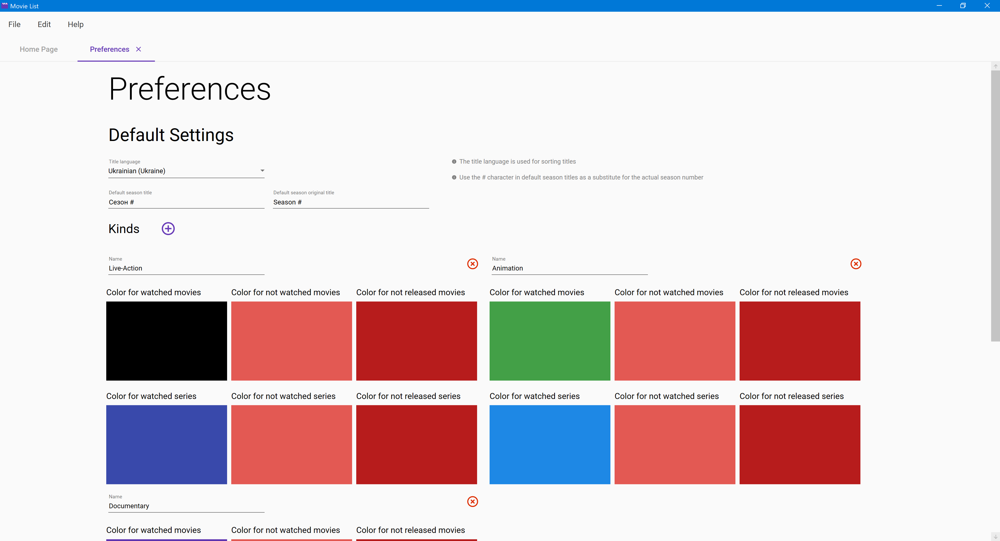

# Preferences

The final feature covered in these docs is the app-wide preferences. You can open them through the _Edit &gt; Preferences_ menu item, or by pressing `Ctrl+Shift+P`, and close them by clicking the _close_ button in the tab header, through the _File &gt; Close_ menu item, or by pressing `Ctrl+W`. Here's how preferences look:

Preferences consist of three sections:

* Default settings
* Other preferences
* Advanced preferences

Preferences are stored in your user's app data folder, under the _MovieList_ directory. If you decide to uninstall the app, you can delete this directory as well, if you don't wish to keep these preferences.

## Default Settings

Default settings are the settings that new files will get when they are created. They are almost identical to the settings you can find if you open a file's settings. The only difference is that you can't set a default list name.

## Other Preferences

Currently the only setting in this section is a check-box which indicates whether to show recent files in the home page, or not. If you uncheck it, the app will clear the recent files list, and won't track which files were opened.

## Advanced Preferences

You probably shouldn't touch these. Currently they only control the app's logging level and log location. You can read more in the article on technical stuff if you so wish. Unlike other preferences, if you change these settings, they will take effect after restarting the app.

