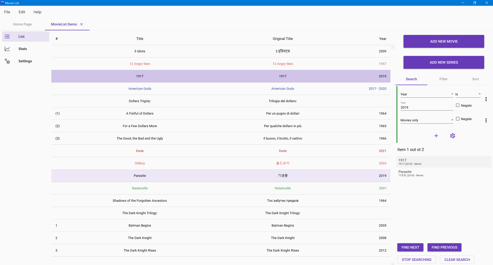
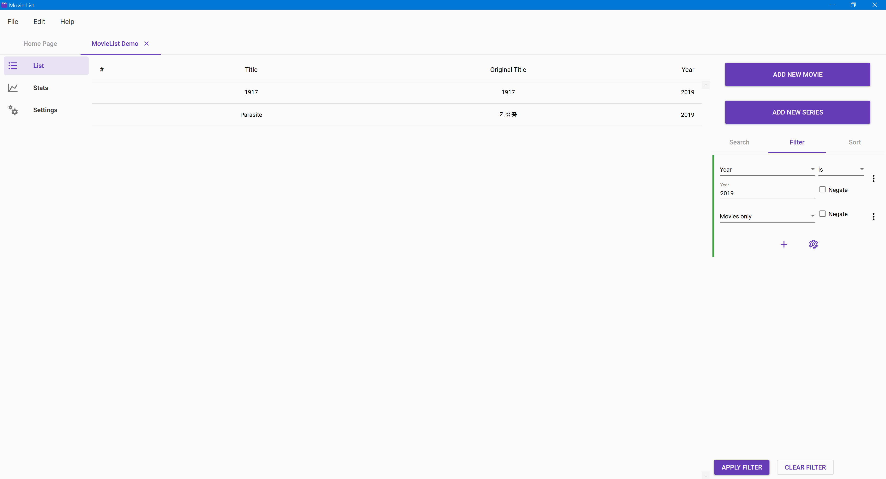
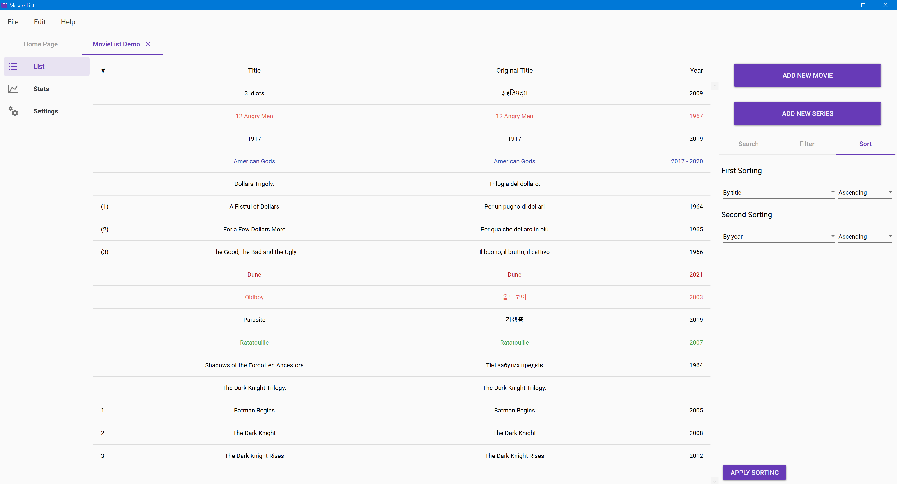

# Searching, Filtering, Sorting

## Searching

You can search for certain items in the list. To do that, specify the filters, and press _Find next_ or _Find previous_. The found items are colored light purple, and the currently selected found item is colored a slightly darker shade of purple. Here's how it looks:

When the search is activated, the list of all found items will appear in the search panel, and you can click on them to jump to those items. To stop searching, click on the _Stop searching_ button. Afterwards, if you click on the _Find next_ or _Find previous_ button again, the search will start from the top or bottom respectively. If you want to stop searching and clear the filters, then click on the _Clear search_ button.

You can't search franchises - only movies or series.

Here's the list of all possible search filters:

* _Title_ - searches by title \(if an item has multiple titles, they are all considered\):
  * _Title is_ - searches for items whose title contains the specified input
  * _Title starts with_ - searches for items whose title starts with the specified input
  * _Title ends with_ - searches for items whose title ends with the specified input
* _Year_ - searches by year:
  * _Year is_ - searches for items of the specified year
  * _Year less than_ - searches for items before the specified year
  * _Year greater than_ - searches for items after the specified year
  * _Year between_ - searches for items between the specified years \(inclusive\)
* _Kind is_ - searches for items of the specified kind
* _Tags_ - searches by tags:
  * _Tags include_ - searches for items which have all of the specified tags
  * _Tags exclude_ - searches for items which have none of the specified tags
  * _Tags have category_ - searches for items which have any tags of the specified category
* _Standalone_ - searches for items which don't belong to a franchise
* _Movies only_ - searches only for movies
* _Watched \(movies only\)_ - searches for movies which are watched
* _Released \(movies only\)_ - searches for movies which are released
* _Series only_ - searches only for series
* _Watch status is \(series only\)_ - searches for series which have the specified watch status
* _Release status is \(series only\)_ - searches for series which have the specified release status
* _Channel \(series only\)_ - searches for series which have the specified channel:
  * _Channel is_ - searches for series whose channel name equals the specified input
  * _Channel starts with_ - searches for series whose channel name starts with the specified input
  * _Channel ends with_ - searches for series whose channel name ends with the specified input
* _Number of seasons \(series only\)_ - searches for series by the number of seasons:
  * _Number of seasons is_ - searches for series which have the specified number of seasons
  * _Number of seasons less than_ - searches for series which have less seasons than the specified number
  * _Number of seasons greater than_ - searches for series which have more seasons than the specified number
  * _Number of seasons between_ - searches for series whose number of seasons is between the specified numbers \(inclusive\)
* _Number of episodes \(series only\)_ - searches for series by the number of episodes:
  * _Number of episodes is_ - searches for series which have the specified number of episodes
  * _Number of episodes less than_ - searches for series which have less episodes than the specified number
  * _Number of episodes greater than_ - searches for series which have more episodes than the specified number
  * _Number of episodes between_ - searches for series whose number of episodes is between the specified numbers \(inclusive\)
* _Miniseries \(series only\)_ - searches for miniseries

You can negate the filters by checking the _negate_ check-box. Remember that it can mean a different thing than what you think. For example, if you negate the _Watched \(movies only\)_ filter, it will search for series as well, because it will search for all items which don't satisfy the _Watched \(movies only\)_ filter, and that includes series. When a filter is negated, a red strip is added on the left side.

The search filters can be composed in several ways. If you click on the right-side three-dot menu, the following options will appear:

* Make composite \(and\)
* Make composite \(or\)
* Remove filter

If you make the filter composite, then three buttons will appear:

* Add filter \(the _plus_ button\)
* Change the filter composition \(the _cog_ button\)
* Simplify \(the _arrows_ button\)

If a composite filter contains only one filter, you can make it a simple filter again by pressing the _simplify_ button. You can add filters to the composite filter by pressing the _add filter_ button.

The nature of the composite filter depends on the composition type of which there are two: _and_ and _or_. If the composition is _and_ then all filters must be positive for the composite filter to be positive. If the composition is _or_ then at least one filter must be positive for the composite filter to be positive. The _and_ composition is shown with a green strip on the left side, and the _or_ composition is shown with a blue strip on the left side. You can change the filter's composition by clicking the _change composition_ button.

Here's an example: in order to search for non-watched movies, you should compose two filters: the negated _Watched \(movies only\)_ and _Movies only_, and set the composition to _and_ because both filters must be positive.

If you want to remove a filter, then you can click on the _remove filter_ in the three-dot menu.

You can create complex hierarchies of filters with multiple layers and different composition types.

## Filtering

Filtering is very similar to searching. As you saw previously, when searching for items you already use various kinds of filters. Filtering the list uses the same principles, but has one big difference - it doesn't highlight the found items. Instead, it shows only the found items. All other items are removed from the list completely. Here's how it looks:

You can't filter franchises - only movies or series. A franchise appears in the filtered list only if one or more of its entries appear in the filtered list.

When you have specified the filters, you can click on the _Apply filter_ button to apply them. Afterwards, you can click on the _Clear filter_ button to return back to the full list.

You can combine searching and filtering, for example by filtering by some general conditions, and then searching with more specific conditions in the filtered list.

## Sorting

You can specify how the list is sorted. There are a couple options, but they are limited. Here's how the sorting panel looks:

Here are the possible sorting orders:

* By title
* By original title
* By title \(simple\)
* By original title \(simple\)
* By year

Sorting by title takes franchises into account, while simple sorting by title doesn't. You can specify the sorting direction as well - ascending or descending.

There are two levels of sorting. The second level is used when the first level is the same \(like having the same title\). You can't add more levels since two levels is enough.

By default the first level of sorting is by title, and the second level is by year. The defaults can be changed in the file's settings, and the default settings for new files can be changed in the preferences.

Sorting by title is available only as the first level, because it's complex and it doesn't make sense to make it second-level. Thus only the three last options are available for the second-level sorting.

